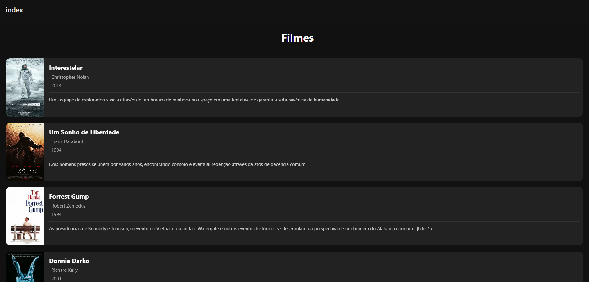

# 🎬 Meu Catálogo de Filmes Essenciais

Este é um aplicativo de catálogo de filmes, desenvolvido com **React Native**, **Expo** e **TypeScript**. Ele apresenta uma lista de filmes com pôsteres, sinopse, título, subtítulo e ano de lançamento.

O app utiliza uma única tela e foca na apresentação visual, com um design moderno de tema escuro, animações sutis na exibição dos cards e dados carregados a partir de um arquivo JSON local.

## 📱 O que o aplicativo faz

- Exibe uma lista de filmes essenciais em formato de cards.
- Cada card apresenta:
  - Pôster do filme
  - Título e subtítulo
  - Ano de lançamento
  - Sinopse

---

## 🚀 Tecnologias Utilizadas

- **React Native**
- **Expo**
- **TypeScript**

---

## 📸 Screenshot da Aplicação

